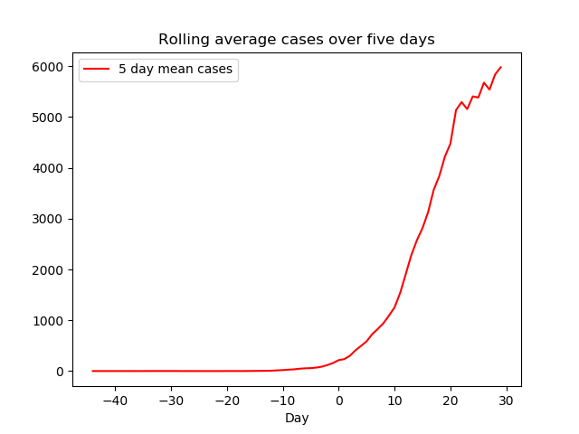

# UK Covid-19 plotter

Plots number of UK cases and deaths with five day rolling average.  Five days
seems to be the minimum to provide enough smoothing to see a long-term trend.
This version is for the original UK data provided via an Excel spreadsheet.
From 14 April the figures are more accurate and the data is provided via
a CSV file.  I'll update this when I get round to it.

```python3 plot.py```

It needs the numpy, pandas and matplotlib Python packages, and xlsx2csv to convert Excel to CSV format.

Day 0 is the date of the first reported death from the disease.




